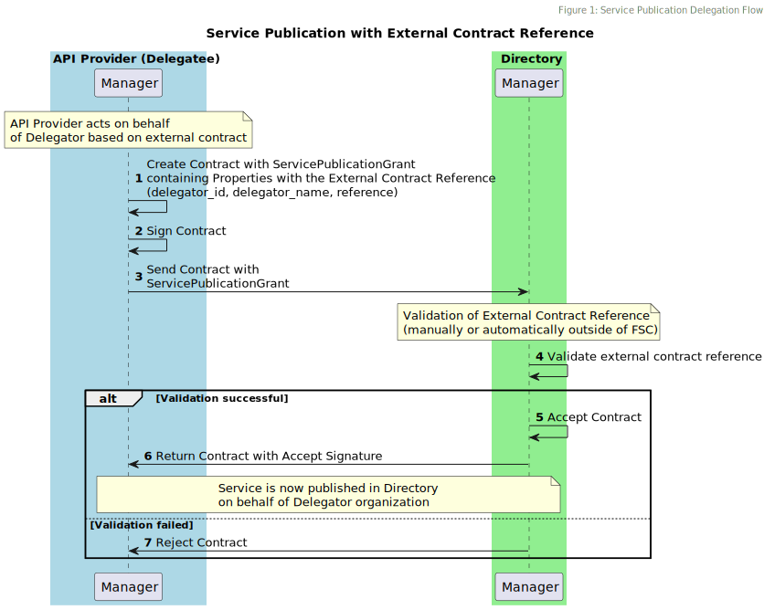
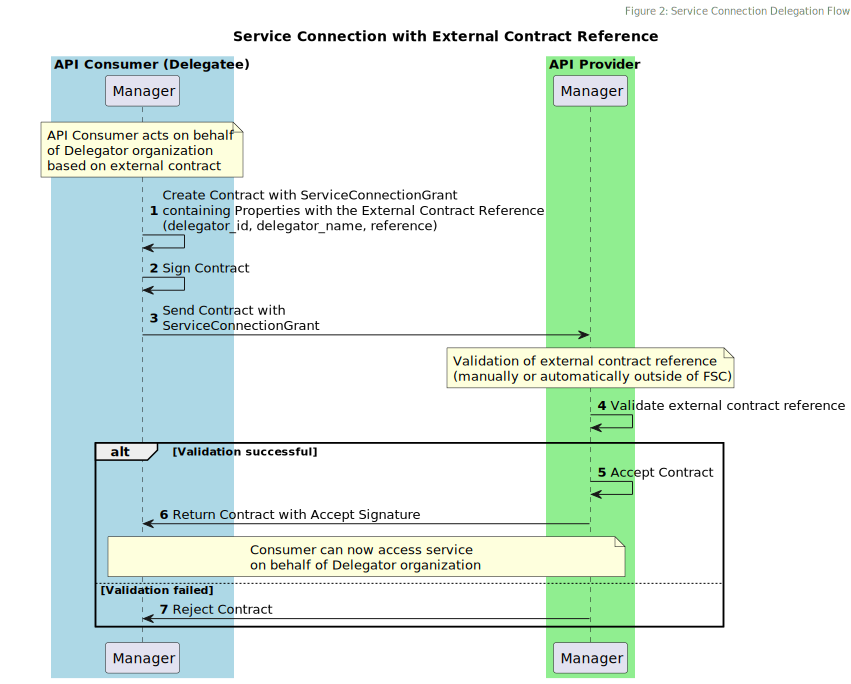

# Architecture

This chapter describes the architecture of an External Contract Reference.

## Trust and Validation Model

The key architectural principle is **trust transfer**: the delegatee asserts authority to act on behalf of the delegator, backed by an external contract reference.
The receiving party (Directory or API provider) performs validation of this assertion before accepting the Contract.

### Trust Relationships

The External Contract Reference introduces a three-party trust model:

1. **Delegator** - The organization on whose behalf services are published or consumed
2. **Delegatee** - The organization (API provider or consumer) acting on behalf of the delegator
3. **Validator** - The organization (Directory or API provider) that validates the External Contract Reference

Trust is established through the external contract, which exists outside the FSC framework.
The *external contract reference* serves as a pointer to evidence of this trust relationship.

### Validation Requirements

When a Contract containing an *External Contract Reference* is received, the receiving organization:

1. MUST verify that the external contract exists and is accessible via the provided reference
2. MUST verify that the external contract grants authority to the delegatee to act on behalf of the delegator
3. MUST verify that the delegator identity (delegator_id and delegator_name) matches the external contract
4. SHOULD verify that the scope of delegation in the external contract covers the specific Service being published or consumed

The validation process itself is **out of scope** for this extension and MUST be performed manually or automatically by a component outside of FSC.

If validation fails, the Contract MUST be rejected. If validation succeeds, the Contract follows the FSC Core Contract lifecycle rules.

## Service Publication Delegation

### Publication Delegation Flow

When an API provider publishes a Service on behalf of a delegator organization, the following architectural flow is executed:

**Step-by-step process:**

1. **Grant Creation**: The Manager of the API provider creates a ServicePublicationGrant containing the property `delegation.publication.external_contract_reference`. This object contains three fields:
   - `reference` - URL or identifier of the external contract
   - `delegator_id` - Identity of the delegator organization
   - `delegator_name` - Name of the delegator organization

2. **Contract Transmission**: The Manager of the API provider creates a Contract containing the `ServicePublicationGrant` and transmits it to the Manager of the Directory.

3. **Validation**: The Directory performs validation of the External Contract Reference according to the validation requirements in Section 2.2

4. **Contract Acceptance or Rejection**:
   - If validation succeeds: The Directory accepts the Contract
   - If validation fails: The Directory rejects the Contract

5. **Contract Completion**: Upon receiving the signed Contract, the API provider signs it, making the Contract valid according to FSC Core rules

6. **Service Publication**: The Service is now published in the Directory on behalf of the delegator organization

### Publication Architecture Implications

The Directory MUST:
- Include the content of `delegation.publication.external_contract_reference` in the Service discovery responses to indicate the true Service owner
- Maintain audit trails of validation decisions for external contract references

## Service Connection Delegation

### Connection Delegation Flow

When an API consumer consumes a Service on behalf of an organization, the following architectural flow is executed:

**Step-by-step process:**

1. **Grant Creation**: The Manager of the API consumer creates a `ServiceConnectionGrant` containing the Property `delegation.connection.external_contract_reference`. This object contains three fields:
   - `reference` - URL or identifier of the external contract
   - `delegator_id` - Identity of the delegator organization
   - `delegator_name` - Name of the delegator organization

2. **Contract Transmission**: The Manager of the API consumer creates a Contract containing the `ServiceConnectionGrant` and transmits it to the Manager of the API provider.

3. **Validation**: The API provider performs validation of the External Contract Reference according to the validation requirements in Section 2.2

4. **Contract Acceptance or Rejection**:
   - If validation succeeds: The API provider signs the Contract and returns it to the API consumer
   - If validation fails: The API provider rejects the Contract

5. **Contract Completion**: Upon receiving the signed Contract, the API consumer signs it, making the Contract valid according to FSC Core rules

6. **Service Access**: The API consumer can now access the Service on behalf of the delegator organization

## Connection Architecture Implications

API providers can use the `delegation.connection.external_contract_reference` added in the `prp` of the access token to:

- perform additional authorization
- offer functionality based on the identity of the delegator

## Property Lifecycle

The architectural flow of external contract reference properties through the system:

1. **Creation**: Properties defined in `ServicePublicationGrant` or `ServiceConnectionGrant`
2. **Contract Storage**: Properties stored with the Contract in the Manager
3. **Access Token Generation** (for service connections only): Properties included in `prp` claim when API consumer requests access
4. **Service Request**: Access token with properties sent to Inway of the API provider
5. **Transaction Logging**: Properties extracted and logged in transaction log as `additional_data`

This end-to-end propagation ensures complete traceability and auditability of delegated service access.

## Integration with FSC Core

This extension integrates with FSC Core as follows:

- **Section 3.2 (Contract Management)**: Adds optional properties to `ServicePublicationGrant` and `ServiceConnectionGrant`
- **Section 3.6 (Delegation)**: Provides an alternative delegation mechanism for organizations that cannot operate FSC Managers
- **Section 3.8 (Authorization)**: External Contract Reference properties in access tokens enable fine-grained authorization decisions
- **Transaction Log Extension**: Defines how External Contract References are logged for auditability
